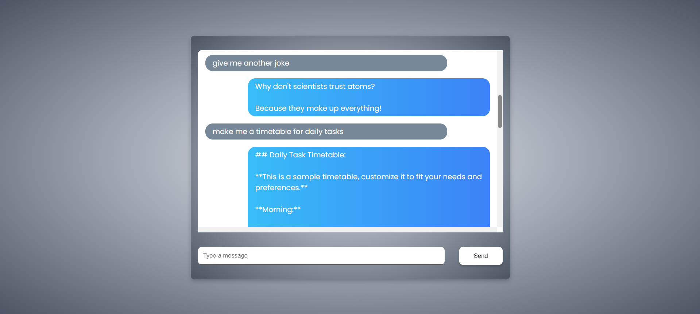

# Chatbot using Node.js and Gemini AI

This project is a simple chatbot application built using **Node.js** and **Express** on the backend and **vanilla JavaScript** on the frontend. The chatbot interacts with the [Gemini AI API](https://developers.google.com/generative-language), which generates responses based on the user's input.

## Demo

If you want to try the chatbot, follow the installation steps below to run it locally on your machine.

## Features

- User input is sent to the Gemini AI API, and the response is rendered dynamically on the web page.
- The chat history is displayed, including both user inputs and bot responses.
- Responsive design with a scrollable message container.



## Installation

### Prerequisites

Make sure you have the following installed on your machine:

- [Node.js](https://nodejs.org/) (v12.x or higher)
- [npm](https://www.npmjs.com/) (Comes with Node.js)

### Steps

- Clone the repository:

  ```bash
  git clone
  ```

- Navigate into the project directory:

  ```bash
  cd chatbot-nodejs
  ```

- Install the dependencies:

  ```bash
  npm install
  ```

- Create a .env file to store your environment variables:

  ```bash
  touch .env
  ```

- Add your API key and port to the .env file:

  ```plaintext
  PORT=5000
  API_KEY=your-gemini-api-key
  ```

- Run the application:

  ```bash
  npm start
  ```

- Open your browser and visit:
  ```plaintext
  http://localhost:5000
  ```
